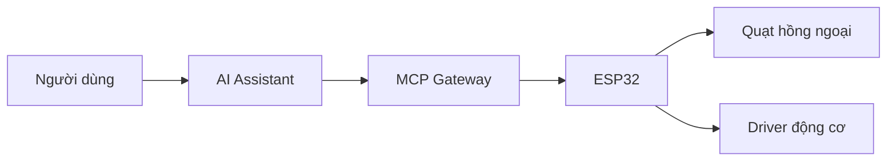

# Quạt Thông Minh Điều Khiển Bằng Giọng Nói (ESP32 + MCP)

Dự án IoT điều khiển **quạt hồng ngoại** và **động cơ** bằng giọng nói, sử dụng **MCP (Model Context Protocol)** trên kết nối **WebSocket**. ESP32 nhận lệnh từ AI, xử lý và kích hoạt phần cứng theo thời gian thực.

## Tính năng chính

- Điều khiển quạt IR và xe động cơ bằng lệnh giọng nói.
- MCP hoạt động qua WebSocket, ESP32 là thiết bị nhận lệnh.
- WiFiManager hỗ trợ cấu hình WiFi lần đầu qua AP tạm.
- Tách tác vụ MCP/IR/Motor bằng FreeRTOS.

## Kiến trúc nhanh

## Bắt đầu nhanh (PlatformIO)

1. Mở dự án bằng VS Code + PlatformIO.
2. Cập nhật endpoint MCP trong [src/config.h](src/config.h) (biến `MCP_ENDPOINT`).
3. Build và nạp firmware bằng PlatformIO.
4. Lần đầu khởi động: kết nối AP `SMART FAN` / `66668888` để cấu hình WiFi.

## Lệnh mẫu

- `fan_control`: `power_on`, `power_off`, `next_speed`, `swing_auto`.
- `car_control`: `forward`, `backward`, `left`, `right`, `stop`.

## Cấu trúc thư mục

- [src](src): mã firmware chính.
- [include](include): header dùng chung.
- [lib](lib): thư viện bổ sung.
- [image](image): ảnh minh họa.

## Tài liệu liên quan

- [README_internal.md](README_internal.md)
- [Model Context Protocol](https://modelcontextprotocol.io)
- [MCP GitHub](https://github.com/modelcontextprotocol)