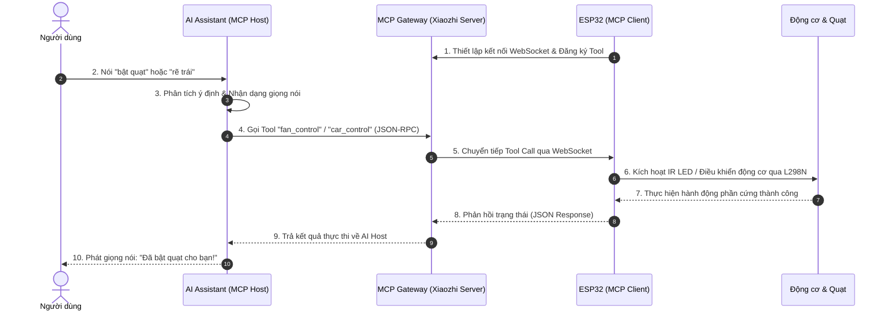
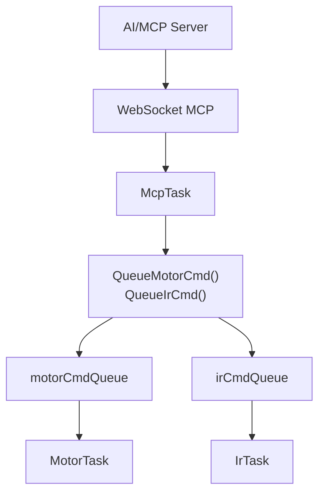
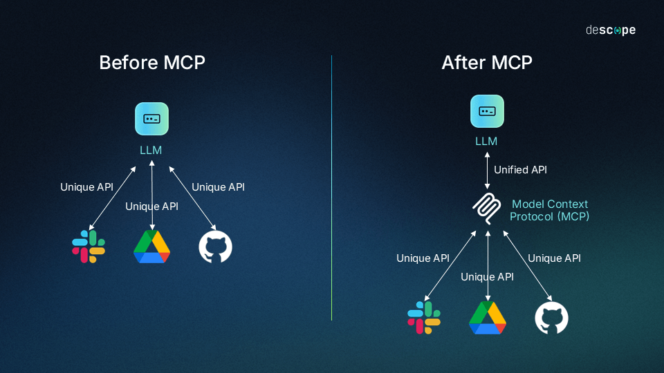
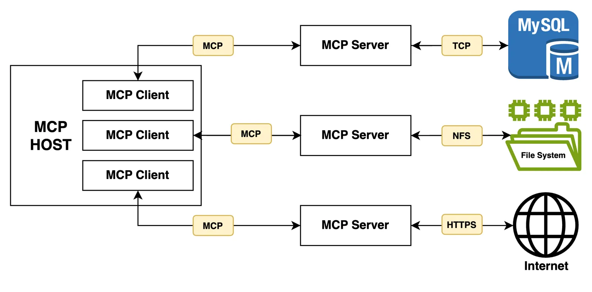
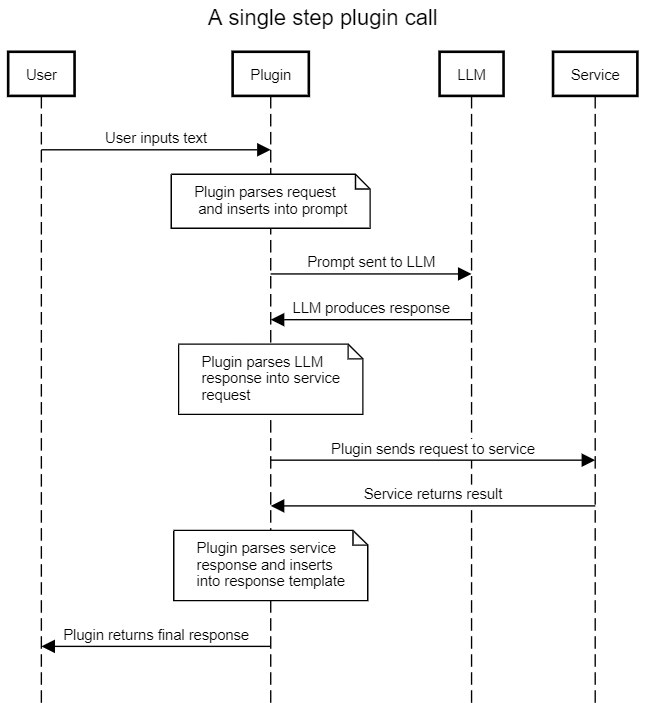

# Quạt Thông Minh Điều Khiển Bằng Giọng Nói 

Dự án IoT tích hợp trí tuệ nhân tạo (AI) giúp **điều khiển quạt hồng ngoại từ xa** và **lái xe động cơ** bằng giọng nói thông qua **Giao thức MCP (Model Context Protocol)** trên nền tảng kết nối **WebSocket**.

---

## Kiến Trúc Hệ Thống & Nguyên Lý Hoạt Động

Dự án hoạt động dựa trên mô hình điều khiển thời gian thực hai chiều giữa **Trí tuệ nhân tạo (LLM)** và **Phần cứng ESP32**:

### Luồng xử lý nội bộ trên ESP32

---

## Giao Thức MCP - Model Context Protocol Là Gì?

### Tại sao AI không thể tự điều khiển quạt?

Hãy tưởng tượng AI như một chuyên gia tư vấn cực kỳ thông minh ngồi trong phòng kín. Bạn có thể hỏi anh ta bất cứ điều gì và anh ta sẽ trả lời rất hay — nhưng anh ta không thể tự tay làm bất cứ điều gì bên ngoài căn phòng đó. Anh ta không thể với tay bật quạt, không thể nhấn nút trên điện thoại của bạn, không thể nhìn thấy nhiệt độ phòng lúc này là bao nhiêu.

Đây chính là giới hạn cốt lõi của mọi mô hình AI: nó chỉ có thể xử lý ngôn ngữ và tạo ra văn bản, nhưng hoàn toàn bị cô lập khỏi thế giới thực. Muốn AI bật được quạt, phải có một cơ chế để nó "nhờ" phần cứng bên ngoài làm thay.

### Cách tiếp cận cũ và vấn đề của nó

Trước khi có MCP, nếu bạn muốn AI điều khiển quạt, bạn phải tự xây dựng toàn bộ đường dây liên lạc giữa AI và thiết bị đó — viết code riêng để AI hiểu khi nào cần bật quạt, viết code riêng để nói chuyện với ESP32, viết code riêng để xử lý phản hồi. Xong dự án quạt, bạn muốn thêm xe điều khiển? Lại phải làm lại từ đầu cho thiết bị mới. Mỗi thiết bị mới là một lần làm lại toàn bộ.

Nhìn vào hình trên: phía trái là cách cũ — mỗi AI phải tự kết nối thủ công với từng công cụ, tạo ra một mạng lưới chằng chịt không thể mở rộng. Phía phải là cách MCP giải quyết — mọi AI và mọi thiết bị đều nói cùng một ngôn ngữ chung, chỉ cần "cắm vào" là dùng được.

### MCP là gì?

**Model Context Protocol (MCP)** là một tiêu chuẩn giao tiếp mở do Anthropic công bố vào tháng 11 năm 2024. Nói đơn giản, nó là một bộ quy tắc chung mà cả AI lẫn thiết bị/phần mềm bên ngoài đều đồng ý tuân theo, để chúng có thể nói chuyện được với nhau mà không cần bên nào phải "tùy chỉnh riêng" cho bên kia.

Hình dung như thế này: ổ cắm điện trong nhà bạn là một chuẩn chung. Bạn không cần biết cái quạt được sản xuất ở đâu, thương hiệu gì — cứ có phích cắm đúng chuẩn là cắm vào dùng được. MCP chính là "ổ cắm điện" đó trong thế giới AI, nhưng thay vì truyền điện, nó truyền lệnh và dữ liệu.

### Ba thành phần trong dự án này

Nhìn vào sơ đồ trên, MCP chia hệ thống thành ba vai trò, ánh xạ trực tiếp vào dự án này như sau:

**Vai trò 1 — AI Assistant (MCP Host):** Đây là "bộ não" của toàn hệ thống, chạy trên server Xiaozhi. Khi bạn nói "bật quạt", chính nó là thứ lắng nghe, hiểu ý bạn, và quyết định cần làm gì tiếp theo. Nó không tự tay bật quạt — nó chỉ ra lệnh.

**Vai trò 2 — Cầu nối trung gian (MCP Client):** Nằm bên trong AI Assistant, đây là bộ phận chịu trách nhiệm "dịch" lệnh của AI sang một định dạng chuẩn mà ESP32 hiểu được, rồi gửi đi qua kết nối WebSocket. Khi ESP32 trả lời, nó lại dịch ngược về để AI đọc được. Người dùng không thấy thành phần này, nhưng nó là cầu nối không thể thiếu.

**Vai trò 3 — ESP32 (MCP Server):** Đây là "bàn tay" thực sự chạm vào phần cứng. ESP32 ngồi chờ lệnh từ cầu nối trung gian. Khi nhận được lệnh bật quạt, nó phát tín hiệu hồng ngoại đúng tần số. Khi nhận được lệnh rẽ trái, nó điều chỉnh hai động cơ theo đúng chiều. Xong việc, nó báo cáo lại kết quả.

### Cách ESP32 "thông báo năng lực" cho AI

Một điểm thú vị của MCP là ESP32 không ngồi chờ AI đoán nó có thể làm gì. Ngay khi khởi động, ESP32 chủ động gửi một bản "danh sách công việc" lên server, khai báo rõ ràng:

- Tôi có thể làm được việc `fan_control` — bật quạt, tắt quạt, đổi tốc độ.
- Tôi có thể làm được việc `car_control` — tiến, lùi, rẽ trái, rẽ phải, dừng.
- Với mỗi việc, tôi cần bạn nói rõ muốn làm hành động nào.

AI đọc bản khai báo này và từ đó hiểu rằng: khi người dùng nói "bật quạt" thì gọi đúng `fan_control`, không phải `car_control`. Khi người dùng nói "rẽ phải" thì gọi `car_control` với hành động "rẽ phải". Mọi thứ rõ ràng, không có chỗ cho việc AI tự đoán mò.

### Luồng hoàn chỉnh khi bạn nói "bật quạt"

Toàn bộ quá trình từ lúc bạn mở miệng đến lúc quạt bật lên chỉ mất vài giây, nhưng bên trong có 6 bước xảy ra tuần tự:

1. **Bạn nói "bật quạt"** — Xiaozhi nhận giọng nói, chuyển thành văn bản, đưa vào AI xử lý.
2. **AI hiểu ý định** — AI đọc câu "bật quạt", đối chiếu với danh sách công việc ESP32 đã khai báo, xác định cần gọi `fan_control` với hành động bật.
3. **Lệnh được đóng gói và gửi đi** — Cầu nối trung gian đóng gói lệnh theo đúng định dạng MCP và gửi đến ESP32 qua kết nối WebSocket đang mở sẵn.
4. **ESP32 nhận lệnh và thực thi** — ESP32 giải mã gói lệnh, kích hoạt chân GPIO 4 để phát tín hiệu hồng ngoại đúng mã lệnh của quạt.
5. **ESP32 báo cáo kết quả** — Sau khi phát tín hiệu xong, ESP32 gửi phản hồi ngược lại: "Đã thực hiện thành công."
6. **AI thông báo cho bạn** — AI nhận được xác nhận, tổng hợp thành câu nói tự nhiên và phát ra loa: "Đã bật quạt cho bạn rồi!"

---

## Cấu Hình WiFi Tự Động (WiFiManager)

Dự án tích hợp thư viện **WiFiManager** để không cần ghi cứng tên mạng WiFi và mật khẩu vào trong code — giúp dễ dàng chuyển thiết bị sang môi trường WiFi khác mà không cần nạp lại firmware.

Lần đầu khởi động, nếu ESP32 chưa từng kết nối WiFi hoặc không tìm thấy mạng cũ, nó sẽ tự động phát ra một điểm phát WiFi tạm thời với tên `SMART FAN` và mật khẩu `66668888`. Người dùng chỉ cần kết nối điện thoại hoặc máy tính vào mạng WiFi này, một trang web cấu hình sẽ tự động hiển thị để chọn mạng WiFi nhà và điền mật khẩu. Sau khi cấu hình thành công, ESP32 lưu thông tin vào bộ nhớ trong và tự động kết nối lại ở những lần khởi động sau mà không cần làm lại bước này.

---

## Cơ Chế Ổn Định & Watchdog

- **MCP watchdog**: nếu ESP32 mất kết nối MCP quá thời gian cấu hình, hệ thống tự khởi động lại để phục hồi.
- **WiFi reconnect**: kiểm tra kết nối định kỳ và tự động reconnect khi bị rớt mạng.

---

## Tập Lệnh Điều Khiển Thử Nghiệm

Dưới đây là một số khẩu lệnh phổ biến đã được kiểm thử và hoạt động trơn tru:

### Điều khiển quạt hồng ngoại 

- "Bật quạt" / "Mở quạt": gọi `fan_control` với `action=power_on` (chỉ gửi khi đang nghĩ quạt tắt).
- "Tắt quạt": gọi `fan_control` với `action=power_off` (chỉ gửi khi đang nghĩ quạt bật).
- "Tăng tốc quạt" / "Đổi tốc độ quạt": gọi `fan_control` với `action=next_speed` (chỉ khi đang bật).
- "Xoay qua lại" / "Lắc quạt": gọi `fan_control` với `action=swing_auto`.
    - Nhịp xoay: trái 2.5s trước, sau đó đổi hướng mỗi 5s.

### Điều khiển động cơ

- "Đi thẳng" / "Tiến lên": gọi `car_control` với `action=forward` (chạy 5s rồi dừng).
- "Đi lùi" / "Lùi lại": gọi `car_control` với `action=backward` (chạy 5s rồi dừng).
- "Rẽ trái" / "Quay trái": gọi `car_control` với `action=left` (rẽ 2s rồi dừng).
- "Rẽ phải" / "Quay phải": gọi `car_control` với `action=right` (rẽ 2s rồi dừng).
- "Dừng lại" / "Đứng yên": gọi `car_control` với `action=stop` để dừng ngay và xóa hàng đợi lệnh (bao gồm xoay quạt).

## Tài liệu tham khảo

- [Model Context Protocol](https://modelcontextprotocol.io)
- [MCP GitHub](https://github.com/modelcontextprotocol)
